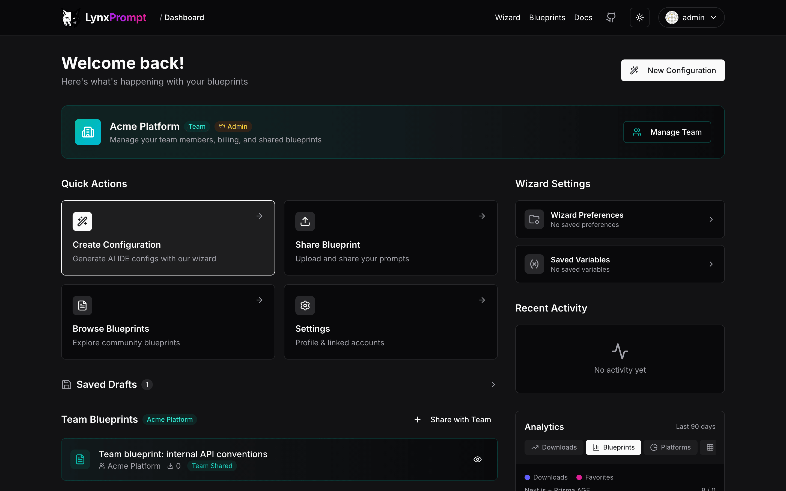

# Getting started

LynxPrompt runs as one container next to PostgreSQL. You need Docker with Compose v2 (or Kubernetes for the
Helm chart) and, for a real deployment, an SMTP server: the default way to sign in is a link sent by mail.
The image is built for linux/amd64; Apple Silicon and Raspberry Pi hosts run it under emulation, which the
compose file turns on with `platform: linux/amd64`.

## Docker Compose

```bash
curl -O https://raw.githubusercontent.com/GeiserX/LynxPrompt/main/docker-compose.selfhost.yml -O https://raw.githubusercontent.com/GeiserX/LynxPrompt/main/docker-compose.mailpit.yml
(umask 077; printf 'NEXTAUTH_SECRET=%s\nDB_PASSWORD=%s\nADMIN_EMAIL=you@example.com\n' "$(openssl rand -base64 32)" "$(openssl rand -hex 24)" > .env)
docker compose -f docker-compose.selfhost.yml -f docker-compose.mailpit.yml up -d
```

What the three lines do:

1. Download the compose file and, for a try-out, the Mailpit file. Mailpit is a local mailbox that catches
   the sign-in mail so you can read the link at http://localhost:8025 without an SMTP server.
2. Write a `.env` only you can read: the session secret, the database password and your own address in
   `ADMIN_EMAIL`. That address becomes the superadmin the first time it signs in.
3. Start PostgreSQL and the app. The first start pulls the image and runs the migrations; `docker compose -f
   docker-compose.selfhost.yml -f docker-compose.mailpit.yml logs -f lynxprompt` shows `Database sync
   complete.` and then the Next.js ready line.

The app listens on http://localhost:3000. `PORT=8080` in `.env` moves it, and `APP_URL` must then be the URL
the browser uses (`http://localhost:8080`, or your domain behind a reverse proxy), because the sign-in link is
built from it.

## First sign-in

Open http://localhost:3000/auth/signin and enter the `ADMIN_EMAIL` address. LynxPrompt mails a link that is
valid for 24 hours. With the Mailpit file, open http://localhost:8025 and click the link there; the dashboard
opens, with Quick Actions, your blueprints, drafts and teams. That account is promoted to superadmin at that
sign-in (the promotion happens whenever the signed-in address equals `SUPERADMIN_EMAIL`, which the compose
file sets from `ADMIN_EMAIL`).



For a real deployment, put your mail server in `.env` and leave the Mailpit file out of the `docker compose`
line:

```bash
SMTP_HOST=smtp.example.com
SMTP_PORT=587
SMTP_USER=lynxprompt
SMTP_PASSWORD=...
SMTP_FROM=lynxprompt@example.com
```

Never expose Mailpit: anyone who can open its port can sign in as anyone. The other ways to sign in (passkeys,
GitHub or Google OAuth, SSO) are switched on in [Configuration](configuration.md#sign-in); passkeys need an
account that already exists, so the first sign-in is always the mail link or OAuth.

## Upgrading

Change the image tag in `docker-compose.selfhost.yml` to the newer release from
[Docker Hub](https://hub.docker.com/r/drumsergio/lynxprompt/tags) and run the same `docker compose ... up -d`.
Migrations run at start. Back up the four databases first (`docker compose ... exec postgres pg_dumpall -U
lynxprompt > backup.sql`).

## Helm chart (Kubernetes)

```bash
helm repo add lynxprompt https://geiserx.github.io/LynxPrompt
helm install lynxprompt lynxprompt/lynxprompt
```

The chart bundles PostgreSQL by default, or points at an external one with `externalDatabase.*`. Its values
are documented in the [chart README](https://github.com/GeiserX/LynxPrompt/blob/main/charts/lynxprompt/README.md)
and listed in [values.yaml](https://github.com/GeiserX/LynxPrompt/blob/main/charts/lynxprompt/values.yaml).
The chart is also on [ArtifactHub](https://artifacthub.io/packages/helm/lynxprompt/lynxprompt).

## Install channels

| What | Channel | Command or link |
|---|---|---|
| Web app | Docker Hub | `drumsergio/lynxprompt` ([tags](https://hub.docker.com/r/drumsergio/lynxprompt/tags)) |
| Web app | Helm | `helm repo add lynxprompt https://geiserx.github.io/LynxPrompt` |
| Web app | Hosted instance | [lynxprompt.com](https://lynxprompt.com), no install |
| CLI `lynxp` | npm | `npm install -g lynxprompt` |
| CLI `lynxp` | Homebrew (macOS, Linux) | `brew install GeiserX/lynxprompt/lynxprompt` |
| CLI `lynxp` | Chocolatey (Windows) | `choco install lynxprompt` |
| CLI `lynxp` | AUR (Arch) | [`lynxprompt`](https://aur.archlinux.org/packages/lynxprompt) |
| CLI `lynxp` | Snap | `snap install lynxprompt` (the snap is 2.1.1 from April 2026, behind the other channels) |
| CLI `lynxp` | Binaries | attached to each [release](https://github.com/GeiserX/LynxPrompt/releases) |
| VS Code | Marketplace | [`LynxPrompt.lynxprompt`](https://marketplace.visualstudio.com/items?itemName=LynxPrompt.lynxprompt), or `ext install LynxPrompt.lynxprompt` |
| CI | GitHub Action | [lynxprompt-action](https://github.com/GeiserX/lynxprompt-action) |
| AI assistants | MCP server | [lynxprompt-mcp](https://github.com/GeiserX/lynxprompt-mcp) |

After installing the CLI: `lynxp config set-url https://lynxprompt.example.com` for your own instance (the
default, which `lynxp config show` prints, is the hosted instance's API at `https://api.lynxprompt.com`), then
`lynxp login`. See [Usage](usage.md#the-cli).
