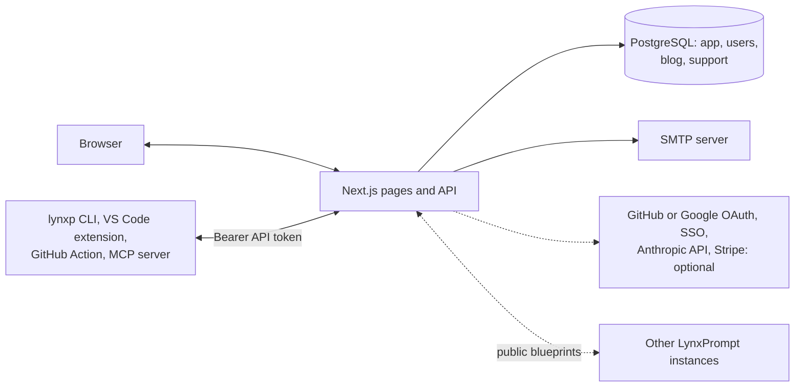

# How it works

## Components

- **The app**: one Next.js 16 process (App Router) that serves the pages and the API on port 3000, running as
  user id 1001 in the `drumsergio/lynxprompt` image (linux/amd64).
- **PostgreSQL** with four Prisma schemas: app (platforms, languages, frameworks, wizard steps, system templates,
  federated instances), users (accounts, sessions, passkeys, teams, blueprints, drafts, hierarchies, API tokens),
  blog and support (the two optional modules). Each schema has its own database, because `prisma db push`
  drops the tables it does not know; the self-host compose file keeps the four databases on one PostgreSQL
  server.
- **Migrations** run at every start: the entrypoint builds the four connection strings from the `DB_*`
  variables, runs `prisma db push` for each schema, and refuses to start if one fails.
- **Mail**: the sign-in link is sent through your SMTP server with nodemailer. Nothing else is mailed unless
  the contact form is on.

## Sign-in

NextAuth with database sessions (30 days, refreshed daily). The providers are built from the feature flags:
the mail link (`ENABLE_EMAIL_AUTH`, on by default, needs `SMTP_*`), passkeys (`ENABLE_PASSKEYS`, for existing
accounts), GitHub and Google OAuth, and SAML, OIDC or LDAP SSO per team. When an account whose address equals
`SUPERADMIN_EMAIL` signs in, it is promoted to superadmin. Roles are USER, ADMIN and SUPERADMIN. With
`ENABLE_USER_REGISTRATION=false`, an address without an account is refused with `RegistrationDisabled`.

## What the CLI and the extension talk to

`lynxp login` opens the configured instance in the browser (`lynxp config set-url`, or `LYNXPROMPT_API_URL`)
and stores an API token. Every call after that is `Authorization: Bearer <token>` against `/api/v1/`. Tokens
are created in Settings, carry a role (`BLUEPRINTS_FULL`, `BLUEPRINTS_READONLY`, `PROFILE_FULL` and others)
and an expiry, and the API answers `401` with the settings URL when one expires. The VS Code extension, the
GitHub Action and the MCP server use the same API with the same tokens.

## Blueprints, variables and hierarchies

A blueprint is text plus a name, a description, a type, a category, tags and a visibility (private, team,
public). `[[VARIABLE|default]]` placeholders are filled at download time. A hierarchy links several
`AGENTS.md` blueprints to paths of one repository, for monorepos; the API exposes it at `/api/v1/hierarchies`
and the CLI as `lynxp hierarchies`.

## Federation

Federation is on by default (`ENABLE_FEDERATION`). At start, and every six hours after, the instance posts its
domain (the host of `APP_URL`) to the registry (`FEDERATION_REGISTRY_URL`, lynxprompt.com by default) and serves
`/.well-known/lynxprompt.json` with its name, version, API URL and number of public blueprints. Instances in
the network share their public blueprints. Private and team blueprints never leave the instance.
`ENABLE_FEDERATION=false` turns all of it off.

## Security model

- Secrets come from environment variables; nothing is read from files in the image.
- Sessions use secure, HttpOnly cookies with the `__Secure-` prefix in production.
- The app rate-limits by client address in memory, per instance: 5000 requests per minute in general and
  300 per minute on the sign-in endpoints, answering `429` with `Retry-After`.
- Every response carries `X-Frame-Options: DENY`, `X-Content-Type-Options: nosniff`, a `Referrer-Policy`, a
  `Permissions-Policy`, a `Content-Security-Policy` and, in production, HSTS.
- The container runs as a non-root user; the compose file publishes only the app port, never PostgreSQL.
- Reporting: [SECURITY.md](https://github.com/GeiserX/LynxPrompt/blob/main/SECURITY.md).

## Where the data is

Everything is in PostgreSQL, in the `pgdata` volume of the compose file. A backup is `pg_dumpall` of that
server; a restore is `psql` into an empty one before the first start. Uploaded files (blog and profile
images) live in the app container's uploads path; the Helm chart gives them a volume.
