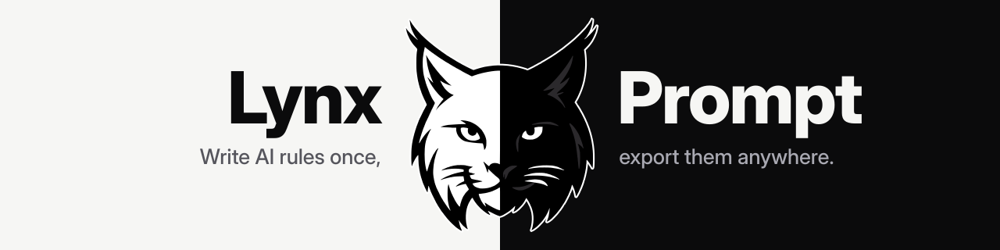
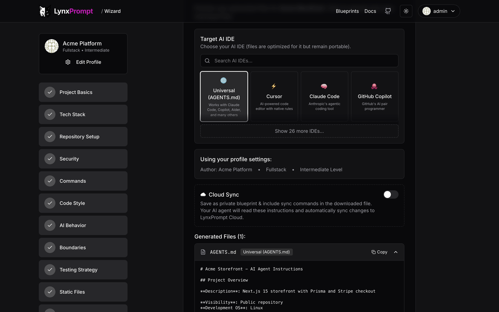
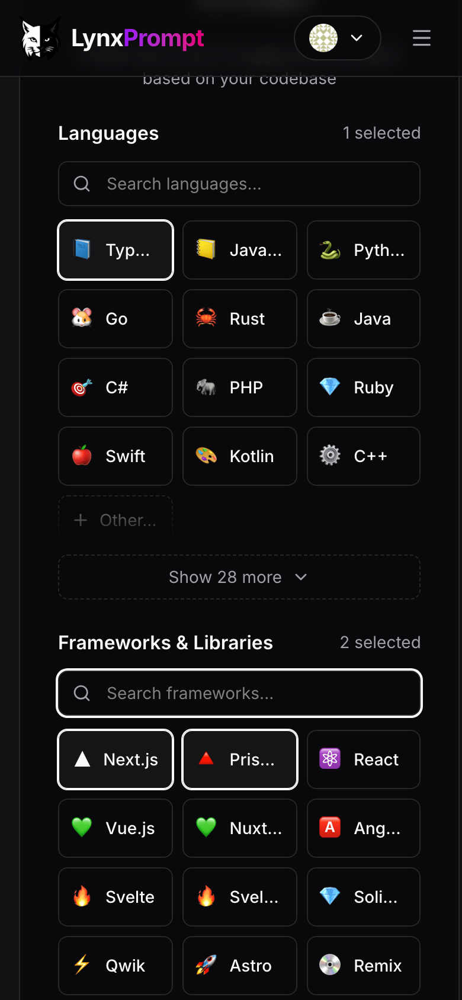
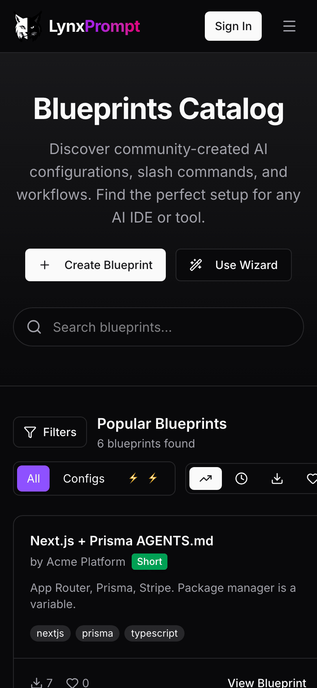
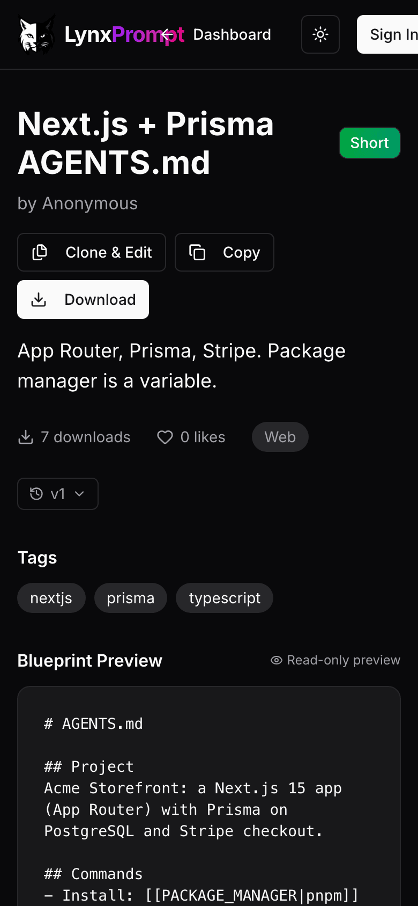
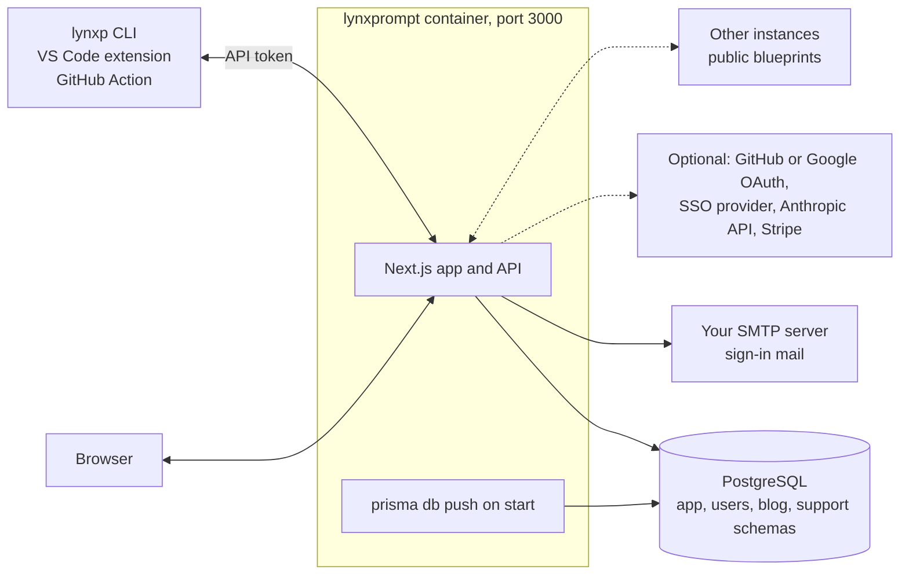

---
hide:
  - navigation
---

# LynxPrompt { .lp-visually-hidden }

  

  
  
  
  

---

**LynxPrompt** is a self-hosted web app that turns one set of AI coding rules into the file each tool reads: `AGENTS.md`, `CLAUDE.md`, `.cursor/rules/`, Copilot instructions, 30 rule-file formats in all, plus slash commands for six of them. A wizard writes the rules from your stack, blueprints let a team share them with variables, and the [CLI and the VS Code extension](usage.md) put the files into every repository.

This site is about running your own instance: [start with Docker Compose](getting-started.md), then the settings, the CLI and how it is built. The product manual (the wizard step by step, blueprints, the CLI and API reference) is a separate site at [lynxprompt.com/docs](https://lynxprompt.com/docs), and [lynxprompt.com](https://lynxprompt.com) is a hosted instance you can try without installing anything.

-   :material-docker: **[Run with Docker](getting-started.md)**

    ---

    Three commands start the app and PostgreSQL, and the Mailpit link signs you in. A Helm chart covers Kubernetes.

-   :material-login-variant: **[Your first sign-in](getting-started.md#first-sign-in)**

    ---

    How the magic link works, how to read it without a mail server, and what the dashboard looks like when it worked.

-   :material-console: **[The CLI and the VS Code extension](usage.md)**

    ---

    `lynxp wizard`, `pull`, `push` and `diff` against your instance, and the same from inside VS Code.

-   :material-format-list-bulleted: **[Environment variables](configuration.md)**

    ---

    Every setting with its default, and the [five you need for sign-in](configuration.md#sign-in).

## The web app

The wizard asks about the project, the stack, the commands, the code style and the boundaries, then writes the files for the tools you pick. [Usage](usage.md#the-web-app) walks through the wizard, the blueprint pages, the dashboard and teams.

<figure markdown>

<figcaption>The wizard</figcaption>
</figure>
<figure markdown>

<figcaption>Blueprints</figcaption>
</figure>
<figure markdown>

<figcaption>One blueprint</figcaption>
</figure>

## What it does

- Exports one set of rules as the rule file of 30 tools: `AGENTS.md`, Cursor, Claude Code, Copilot, Windsurf, Zed, Aider, Gemini CLI, Cline, Roo Code, Amazon Q, JetBrains Junie and the rest of the list in [Features](features.md), plus slash commands for Cursor, Claude Code, Windsurf, Copilot, Continue and OpenCode.
- Builds those rules in a 12-step wizard on the web, or with `lynxp wizard` in a terminal; `lynxp analyze` reads an existing repository first.
- Keeps blueprints with `[[VARIABLE|default]]` placeholders, so one blueprint fits many projects. Each blueprint is private, shared with a team, or public.
- Gives a team its own page and its own blueprints. Federation lets instances that join share their public blueprints with each other.
- Manages hierarchical `AGENTS.md` files for monorepos, from the dashboard, the CLI (`lynxp hierarchies`) and the API.
- Serves the same data to the [CLI](usage.md#the-cli), the [VS Code extension](usage.md#vs-code-extension) and a REST API with per-token roles.
- Signs users in with a magic link, passkeys, GitHub or Google OAuth, or SAML, OIDC and LDAP SSO; each is one environment variable.
- Edits blueprints with Claude when you set your own Anthropic API key; off by default, and everything else works without it.

## How it runs

- The image is `drumsergio/lynxprompt`, built for linux/amd64, running as user id 1001. On an ARM host (Apple Silicon, Raspberry Pi) the compose file's `platform: linux/amd64` line runs it under emulation.
- Migrations run every time the container starts (`prisma db push` on the four schemas), so an upgrade is a tag change and `docker compose up -d`.
- The self-host compose file runs one PostgreSQL server with one database per schema (`lynxprompt`, `lynxprompt_users`, `lynxprompt_blog`, `lynxprompt_support`). See [Components](how-it-works.md#components).
- The CLI and the extension talk to `/api/v1/` with an API token you create in Settings. See [How it works](how-it-works.md).

## What it does not do

- It does not send mail by itself. The default login is a magic link, so a real deployment needs the five `SMTP_*` variables; the [Mailpit file](getting-started.md#first-sign-in) is only for trying it out.
- It does not run your AI tools. It writes the files they read.
- It does not edit with AI unless you give it an Anthropic API key.
- It does not ship an ARM image; ARM hosts run the amd64 image under emulation, which is slower.

## Privacy

- Accounts, blueprints, drafts and teams live in your PostgreSQL. Back up the `pgdata` volume and you have everything.
- Every other outside service is off until you switch it on with an environment variable: SMTP for sign-in mail, GitHub and Google for OAuth, an SSO provider, Anthropic for AI editing, Stripe for paid marketplace listings, Cloudflare Turnstile, Umami analytics. See [Configuration](configuration.md).
- Federation is on by default: at start and every six hours the instance sends its domain (the host of `APP_URL`) to the registry at lynxprompt.com, and `/.well-known/lynxprompt.json` answers with its name, version and number of public blueprints. Only blueprints marked public are shared. `ENABLE_FEDERATION=false` turns it off.
- The security policy is in [SECURITY.md](https://github.com/GeiserX/LynxPrompt/blob/main/SECURITY.md).

## Getting help

- If something is broken, read [Troubleshooting](troubleshooting.md), then open an issue with the details in [Reporting a bug](troubleshooting.md#reporting-a-bug).
- To report a security problem, follow the [security policy](https://github.com/GeiserX/LynxPrompt/blob/main/SECURITY.md) and do not open a public issue.
- The [releases page](https://github.com/GeiserX/LynxPrompt/releases) lists what changed in each version.
- To send a fix or a feature, read [Development](development.md) and [CONTRIBUTING.md](https://github.com/GeiserX/LynxPrompt/blob/main/CONTRIBUTING.md).

## License

LynxPrompt is released under the [AGPL-3.0-or-later](https://github.com/GeiserX/LynxPrompt/blob/main/LICENSE) license.
