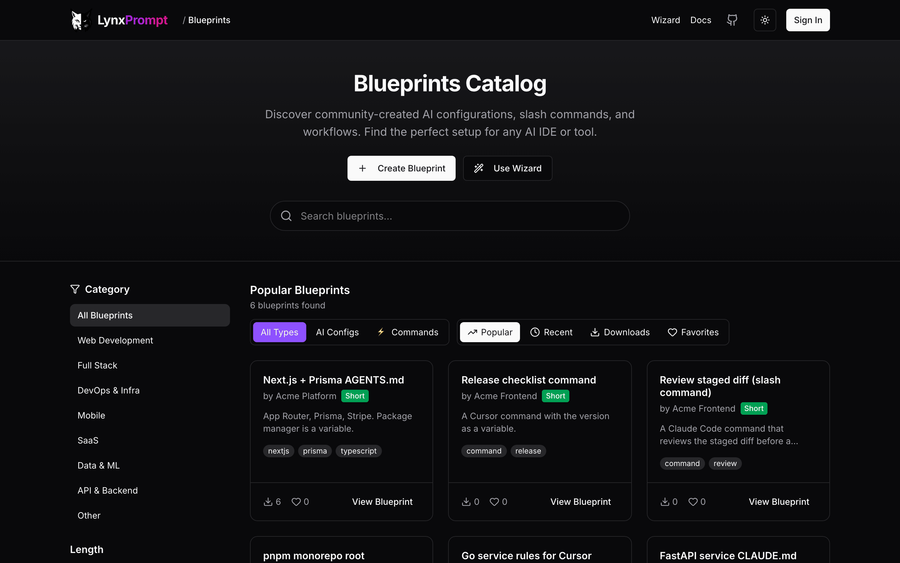
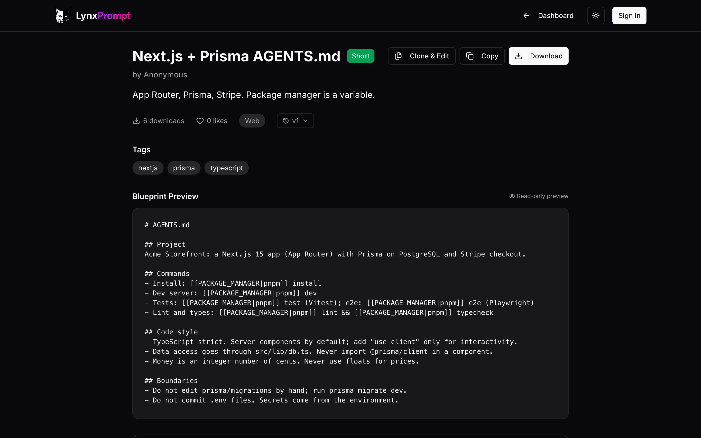
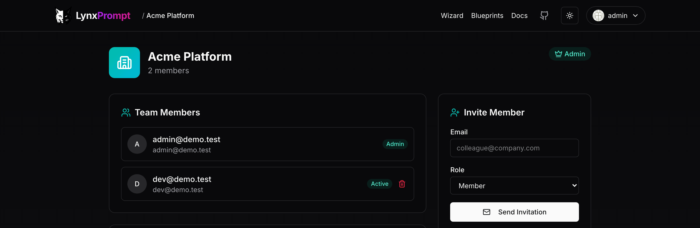

# Usage

## The web app

- **Wizard** (`/wizard`): twelve steps (Project Basics, Tech Stack, Repository Setup, Security, Commands, Code
  Style, AI Behavior, Boundaries, Testing Strategy, Static Files, Anything Else?, Generate). Every step is
  available to every account. It works signed out; sign in to keep the result as a blueprint or a draft.


- **Blueprints** (`/blueprints`): the public list, searchable and sortable; each blueprint page shows the
  content, its `[[VARIABLE|default]]` placeholders, tags, the author and a download button. Your own
  blueprints are private, shared with a team or public.





- **Dashboard** (`/dashboard`): Quick Actions, My Blueprints, Team Blueprints, Saved Drafts and the
  hierarchical `AGENTS.md` sets for monorepos.
- **Teams** (`/teams`): create a team with a name and a slug, invite members (the invite is a link you copy
  from the team page; no mail is sent), and share blueprints with the team only. Team blueprints show on the
  dashboard.



- **Settings** (`/settings`): profile, security (passkeys), API tokens.

## The CLI

The CLI tool mirrors the web platform and works against any LynxPrompt instance. By default it connects to `lynxprompt.com`, but you can point it to any self-hosted deployment.

```bash
# Install
npm install -g lynxprompt

# (Optional) Point to a self-hosted instance — two ways:
lynxp config set-url https://lynxprompt.your-company.com
# or: export LYNXPROMPT_API_URL=https://lynxprompt.your-company.com

# Authenticate (opens browser on the configured instance)
lynxp login

# Generate AI config files interactively
lynxp wizard

# Pull a blueprint
lynxp pull bp_abc123

# Push local configs
lynxp push

# View current CLI configuration
lynxp config
```

The API URL is stored in the CLI config file (see `lynxp config path`). The `LYNXPROMPT_API_URL` environment variable takes precedence if set.

Also available via Homebrew (`brew install GeiserX/lynxprompt/lynxprompt`) and Chocolatey (`choco install lynxprompt`).

A recording of `lynxp wizard`, `check`, `push`, `diff` and `analyze` against the hosted instance:
[demo.gif](images/demo.gif) (6.5 MB). The full command reference is in the
[product manual](https://lynxprompt.com/docs/cli).

## VS Code extension

Prefer managing configs without leaving the editor? LynxPrompt also has an official VS Code extension. The extension is
[`LynxPrompt.lynxprompt` on the Marketplace](https://marketplace.visualstudio.com/items?itemName=LynxPrompt.lynxprompt);
source in [lynxprompt-vscode](https://github.com/GeiserX/lynxprompt-vscode).

From inside VS Code you can:

- Browse your cloud blueprints and local AI config files in a dedicated sidebar
- Pull `AGENTS.md`, `CLAUDE.md`, `.cursor/rules/`, and more into the correct workspace paths
- Diff local files against their cloud versions with the built-in editor
- Push updates back to LynxPrompt without leaving VS Code

Install it from the Marketplace or run `ext install LynxPrompt.lynxprompt`.

## The API

Create a token in Settings > API Tokens (`/settings?tab=api-tokens`); tokens have a role (full or read-only
blueprint access, profile access) and an expiry. Send it as `Authorization: Bearer <token>` to `/api/v1/`:
`GET` and `POST /api/v1/blueprints`, `/api/v1/hierarchies`, `/api/v1/user`. The API reference in the
[product manual](https://lynxprompt.com/docs/api) lists every field.
